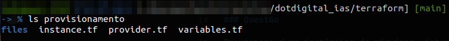

# Provisione duas instâncias de máquinas virtuais via Terraform

Tabela de conteúdos
=================
<!--ts-->   
   * [Questão](#questão)   
   * [Tecnologias](#-tecnologias-utilizadas)
   * [Contribuição](#contribuição)
   * [Autor](#autor)
   * [Licença](#licença)
<!--te-->

### Questão

Provisione duas instâncias de máquinas virtuais (preferencialmente na AWS) via Terraform. Utilizando o Ansible, em uma das VMs, faça a instalação de uma ferramenta de CI/CD e configure uma pipeline de deploy para uma aplicação open-source de sua escolha (ou faça uma simples API com um endpoint de retorno), tendo como destino para este deploy a segunda VM, onde a aplicação irá rodar. (Envie o endereço do git com a execução da tarefa)

#### Terraform configuração

- Foi criado um diretório **provisionamento** que contem os seguintes arquivos:

Onde o arquivo **variables.tf** contem as variaveis para configuração das VMs na AWS.

- region:  Define em qual regiao a instancia sera executada
- name: Define o nome da instancia
- ami: Define o ID da imagem modelo para o servidor
- instance_type: Define o tipo de Instancia na AWS
- subnet_id: Define o ID da subrede VPC
- vpc_security_group_ids: Define o ID do grupo de seguranca
- key_name: Define o nome da chave de acesso SSH

Onde o arquivo **provider.tf** contem a variavel para configuração do provedor AWS.

Onde o arquivo **instance.tf** carregam as variaveis declaradas no arquivo **variables.tf** e constroi a instancia na AWS, também direciona para um script de instalação do **docker** e **docker-compose** que será utilizado para construir o ambiente de testes.

### 🛠 Tecnologias Utilizadas

As seguintes ferramentas foram usadas na construção do projeto:

- [Git](https://git-scm.com/)
- [Docker 20.10.17](https://docs.docker.com/engine/)
- [terraform 1.2.6](https://www.terraform.io/docs)
- [jenkins LTS](https://www.jenkins.io/doc/)
- [gitea 1.16.4](https://docs.gitea.io/en-us/)

### Contribuição

* [Wagner C Oliveira](https://www.wagneroliveira.eti.br)

### Autor

* [Wagner C Oliveira](https://www.wagneroliveira.eti.br)

### Licença

* [GNU General Public License (GPL)](https://www.gnu.org/licenses/gpl-3.0.html)